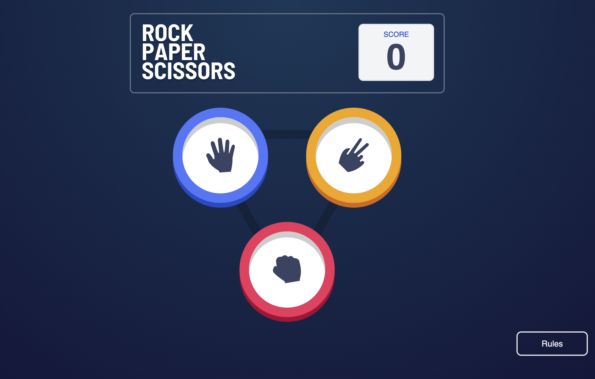
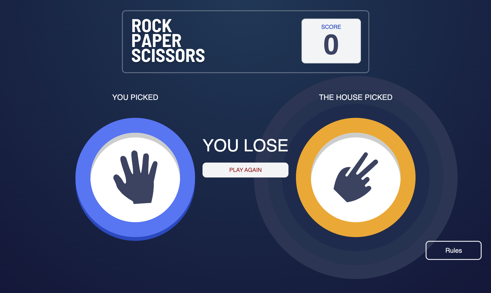

# Frontend Mentor - Rock, Paper, Scissors solution

This is a solution to the [Rock, Paper, Scissors challenge on Frontend Mentor](https://www.frontendmentor.io/challenges/rock-paper-scissors-game-pTgwgvgH). Frontend Mentor challenges help you improve your coding skills by building realistic projects. 

## Table of contents

- [Overview](#overview)
  - [The challenge](#the-challenge)
  - [Screenshot](#screenshot)
  - [Links](#links)
- [My process](#my-process)
  - [Built with](#built-with)
  - [What I learned](#what-i-learned)
  - [Continued development](#continued-development)
- [Author](#author)

## Overview

### The challenge

Users should be able to:

- View the optimal layout for the game depending on their device's screen size
- Play Rock, Paper, Scissors against the computer

### Screenshot




### Links

- Live Site URL: [https://your-live-site-url.com](https://nickis-rock-paper-scissors.netlify.app/)

## My process

### Built with

- Semantic HTML5 markup
- CSS custom properties
- Flexbox
- [React](https://reactjs.org/) - JS library
- [Remix](https://remix.run/) - React framework
- [Tailwind](https://tailwindcss.com/) - For styles

### What I learned

I learned about routing in Remix, and refreshed my knowledge of React including useEffect, using outlet context and handling modals 

I loved using tailwind in my markup, I have never doen this before and it made it so much easier to work with the styling. 

I'm proud that I finally figured out I could use box-shadow to create the 3 concentric circles, after initially struggling with using 3 div styled as circles and trying to line them up all with the winning icon

```css

.winner {
    box-shadow: 
      0 0 0 30px hsl(var(--winner-highlight)), 
      0 0 0 60px hsl(var(--winner-highlight-2)), 
      0 0 0 90px hsl(var(--winner-highlight-3)); 
}
```

### Continued development

I'd like to try getting the modals working using routes next time and I want to learn more about deploying in netlify.

## Author

- Frontend Mentor - [@nicki-moody](https://www.frontendmentor.io/profile/nicki-moody)
